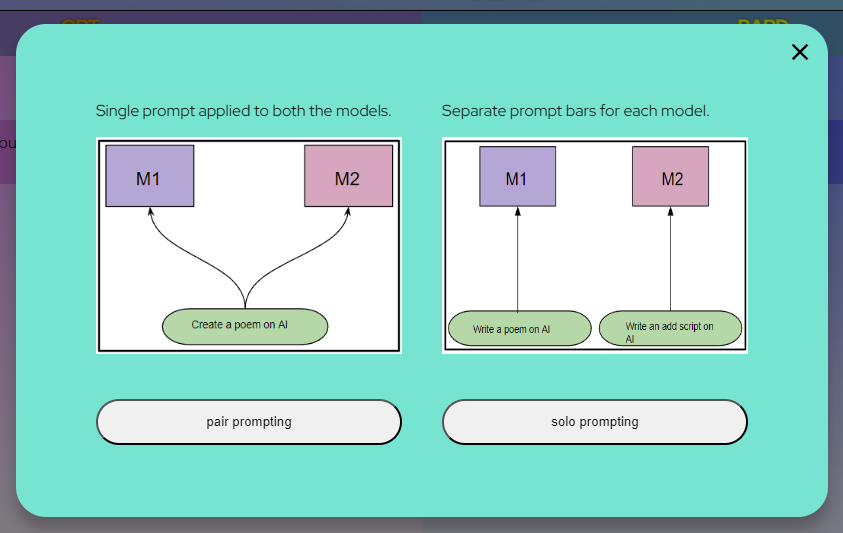

# Pairllm-Chat

PairLLMChat is an innovative approach to using Multiple AI Chatbots like GPT, Bard, Palm under one roof, in a single web view. The application eliminates the need to switch between browser tabs or windows if you love to use multiple chatbots at the same time or compare their results against the same prompt, like me :)

PairLLM Chat allows you to compare the results of 2 or more chatbots together, against the same prompt/query.
This is made possible with a common PromptBAR that triggers responses from both the models asynchronously.

PairLLM Chat also allows you to have a separate prompt bar for each chat. Thus, enabling you to make distinct queries to separate models.

You can choose to opt between pair-prompting and soloprompitng whenever you want- WITHOUT removing your previous chat History.

Things under progress:
>UI Makeover

>Support for models like Llama2, Claude and Bard. (Bard is clunky, But I'll try)

>Resizable chatlogs
